# Automated Lead Capture, Qualification, and CRM Follow-Up System

## Project Status
Working MVP completed and tested successfully.

The workflow currently:
- Captures new Google Form submissions
- Stores responses in Google Sheets
- Creates lead records in Airtable
- Calculates lead scores based on budget
- Sets follow-up dates automatically
- Sends customer confirmation emails
- Sends sales alerts to Slack

## Business Problem
Businesses often receive inquiries through online forms but manually transfer lead information into spreadsheets or CRM systems. This can cause delays, missed follow-ups, duplicate records, and poor lead prioritization.

## Project Objective
To automatically capture customer inquiries, organize lead information in Airtable, assign an initial status, calculate a lead score, notify the sales team, and send a confirmation email to the customer.

## Workflow
Google Form → Google Sheets → Make.com → Airtable CRM → Gmail Confirmation → Slack Notification

## Tools Used
- Google Forms
- Google Sheets
- Make.com
- Airtable
- Gmail
- Slack
- GitHub
- Loom

## Current Progress
- Lead inquiry form created
- Google Sheets response collection configured
- Airtable CRM structure completed
- Requirements documented
- Process map created
- Test data prepared
- Error log prepared
- Complete Make.com workflow tested successfully from form submission to CRM, email confirmation, and Slack notification.
  
## Screenshots
Project screenshots are available in this repository.

## Project Evidence

### Airtable CRM — Main Fields

### Airtable CRM — Tracking Fields
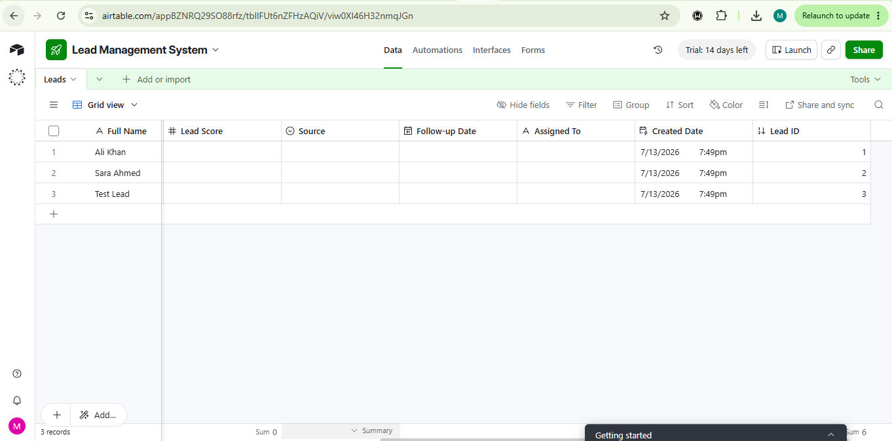

### Google Lead Inquiry Form
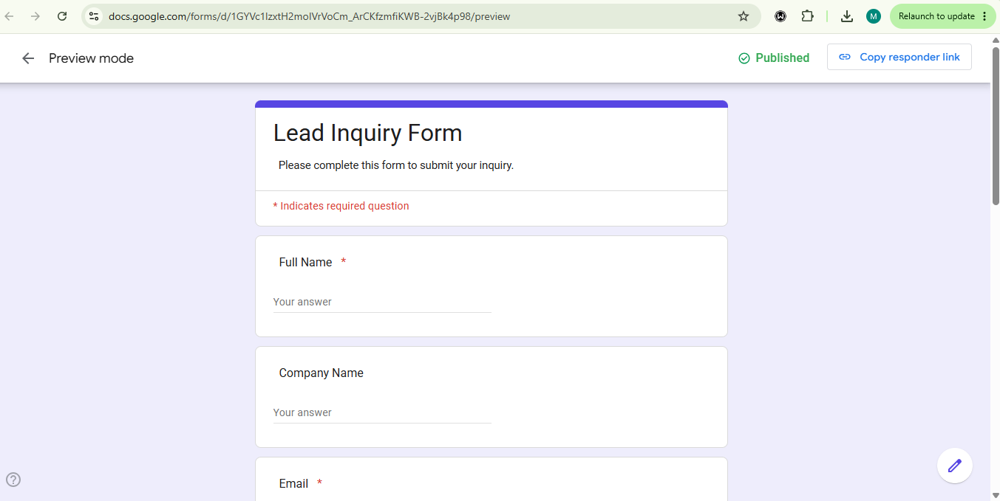

### Google Sheets Lead Response
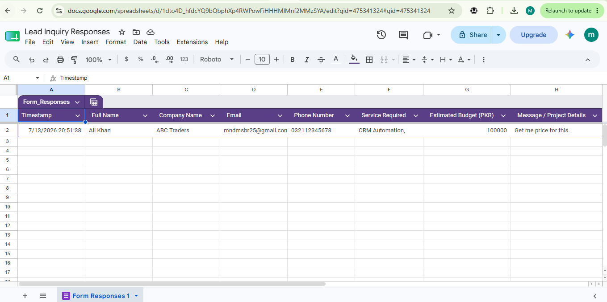

### Airtable Lead Pipeline
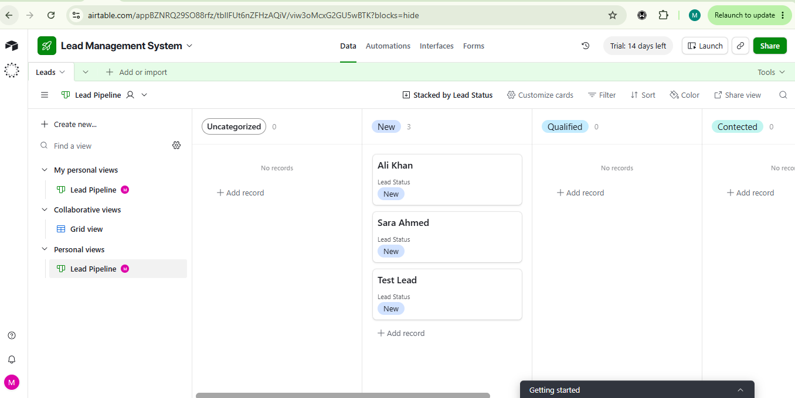

### Slack New Lead Notification
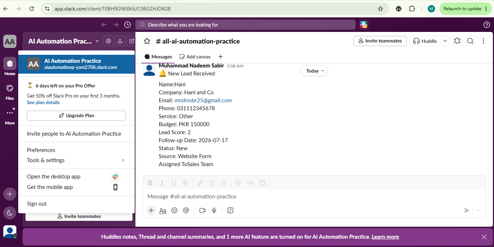

### Complete Make Automation Workflow
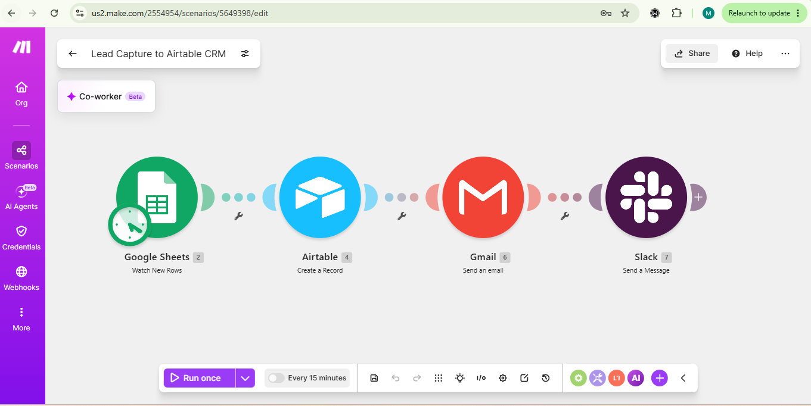

### Customer Confirmation Email
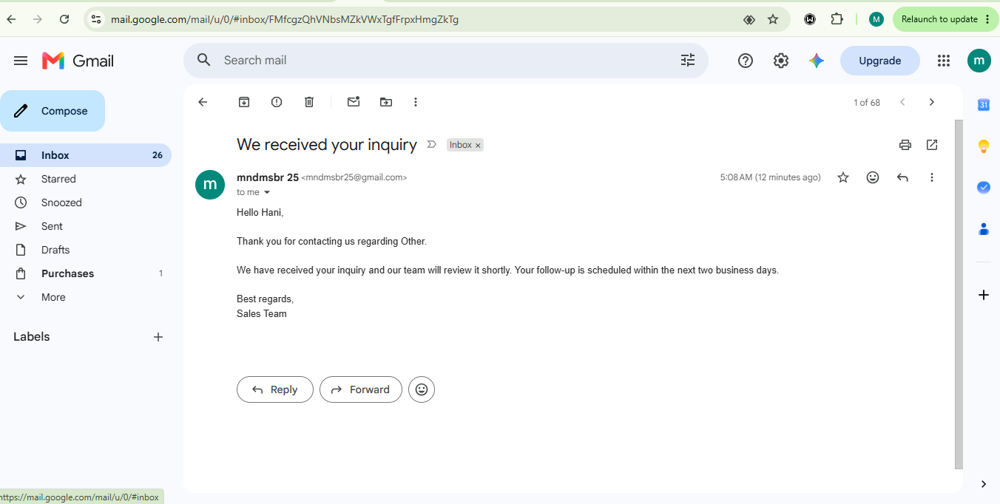

### Automation Test Results
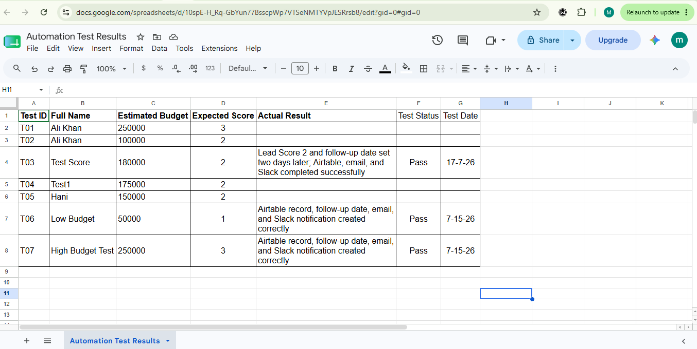

### Error Log and Resolutions
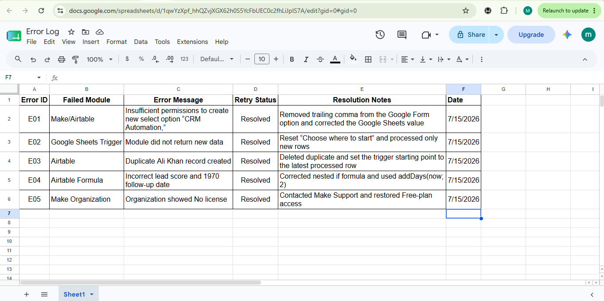

## Project Demo
[Watch the Automated Lead Capture and CRM Follow-Up System Demo](https://www.loom.com/share/385f62fb0fcd461dbf194b11a26fa1ee )

## Scenario Blueprint

A sanitized Make.com blueprint is included for reviewing the workflow structure and mappings.

[Download the sanitized Make blueprint](Lead_Capture_to_Airtable_CRM_SANITIZED.blueprint.json)

Before importing, replace the placeholder connection IDs, Google Sheet ID, Slack channel ID, and other account-specific values with your own configuration.

## Reliability and Error Handling

The workflow includes an Airtable error-handler route.

When Airtable rejects a lead:

- The error is logged in the `Automation Errors` Google Sheet
- The failed module and error message are recorded
- The affected bundle is skipped safely
- Customer confirmation email is not sent
- Slack sales notification is not sent
- Other valid leads can continue processing

The error handler was successfully tested using an invalid Airtable single-select value.

### Live Error Handler Test
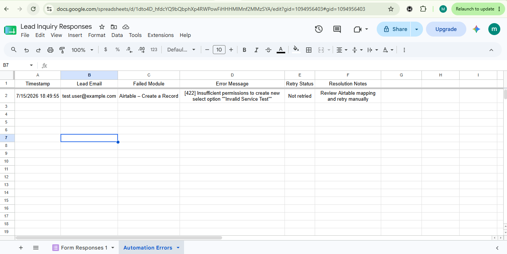

The workflow successfully captured an Airtable validation failure, logged the error in Google Sheets, and stopped customer and sales notifications for the failed lead.

### Complete Workflow With Error Handling
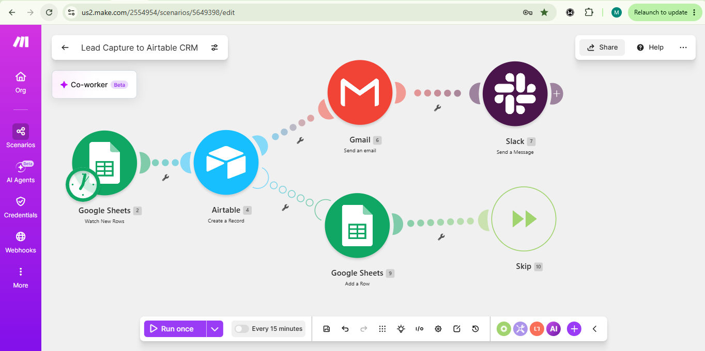

## Duplicate Lead Detection

The workflow checks Airtable for an existing lead before creating a new record.

### How It Works

1. A new lead is captured through Google Forms.
2. Google Sheets Watch New Rows sends the response to Make.
3. Airtable Search Records checks the submitted email address.
4. The Array Aggregator collects the search result.
5. A Router separates new and duplicate leads.

### New Lead Route

When no Airtable Record ID is found:

- A new lead is created in Airtable.
- A confirmation email is sent through Gmail.
- A sales notification is sent to Slack.
- Lead score and follow-up date are automatically generated.

### Duplicate Lead Route

When an Airtable Record ID already exists:

- No new Airtable record is created.
- Gmail and Slack modules are skipped.
- The duplicate submission is logged in the Duplicate Leads sheet.
- The phone number and existing Airtable Record ID are recorded.

### Duplicate Detection Test Result

The duplicate detection test passed successfully. The workflow identified an existing email, blocked duplicate record creation, and logged the submission with its original Airtable Record ID.

